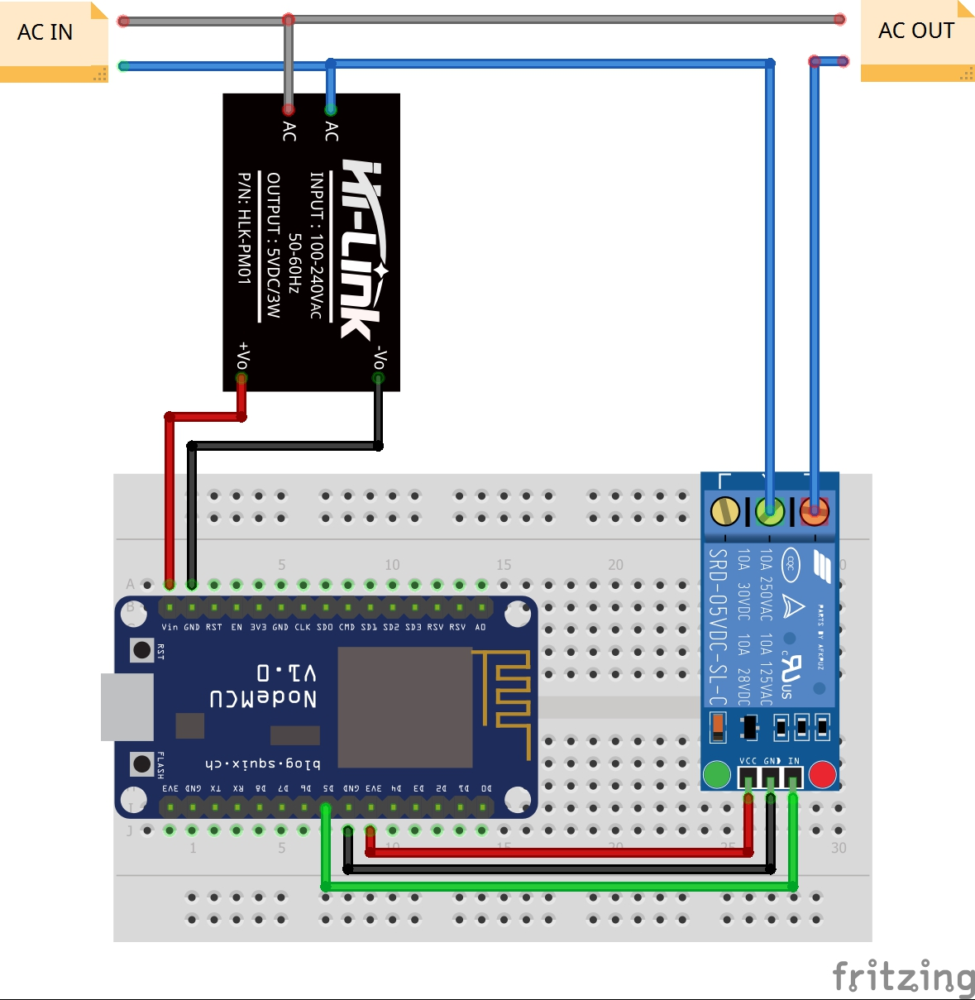

# NodeMCU_REST_Relay

A simple http REST webserver in a NodeMCU (ESP8266) microcontroller with a Relay.

  

## Installation and Flash

Clone the repo. Then:

* Install Arduino IDE
* From Arduino IDE:
  * File > PRefernces and paste following url in "Additional Bords": https://arduino.esp8266.com/stable/package_esp8266com_index.json
  * Tools > Board menu and install esp8266 platform
  * Sketch > Include Liobrary > Manage Libraries and install ArduinoJson
* Install [CH34x](https://sparks.gogo.co.nz/ch340.html) or [CP210X](https://www.silabs.com/developers/usb-to-uart-bridge-vcp-drivers?tab=downloads) drivers depending on your NodeMCU (bigger is 0.9 needs CH34x, smaller is 1.0 and needs CP210x)
* Copy example_secrets.h to secrets.h and set your wifi credentials
* If needed change the static IP address
* Connect, select the COM port and flash

## API

A complete API with example can be found [here](API/ApiExamplePostmanCollection.json).

The API are:

- simple webserver on '/'
- POST on '/control' with json like `{"relay": false}` or `{"relay": false}` to change realy state
- GET on '/status' that answers with `{"status": "on"}` or `{"status": "off"}`
